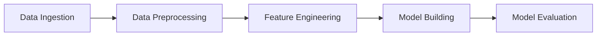

# 🚀 Employee Attrition Prediction - MLOps Pipeline

A production-ready machine learning pipeline for predicting employee attrition using **DVC** for data versioning and **MLflow** for experiment tracking.


---

## 📋 Table of Contents

- [Overview](#overview)
- [Project Structure](#project-structure)
- [Pipeline Stages](#pipeline-stages)
- [Installation](#installation)
- [Usage](#usage)
- [Experiment Tracking](#experiment-tracking)
- [Configuration](#configuration)
- [Model Metrics](#model-metrics)

---

## 🎯 Overview

This project predicts whether an employee will leave the company (**Attrition**) based on various factors like job satisfaction, work-life balance, income, and more. The pipeline is fully automated using **DVC** and includes comprehensive logging and experiment tracking with **MLflow**.

### Key Features

- ✅ **End-to-end ML Pipeline** - From data ingestion to model evaluation
- ✅ **DVC Pipeline** - Reproducible experiments with data versioning
- ✅ **MLflow Integration** - Track experiments, parameters, and metrics
- ✅ **Random Forest Classifier** - Handles class imbalance with balanced weighting
- ✅ **Feature Engineering** - Derived features for improved accuracy
- ✅ **Comprehensive Logging** - Debug logs for each pipeline stage

---

## 📁 Project Structure

```
MLOps/
├── data/
│   ├── raw/              # Raw train/test splits
│   ├── interim/          # Preprocessed data
│   └── processed/        # Final engineered features
├── logs/                 # Pipeline execution logs
├── models/
│   ├── model.pkl         # Trained Random Forest model
│   └── scaler.pkl        # StandardScaler for features
├── mlruns/               # MLflow experiment tracking
├── reports/
│   └── metrics.json      # Evaluation metrics
├── src/
│   ├── data_ingestion.py
│   ├── data_preprocessing.py
│   ├── feature_engineering.py
│   ├── model_building.py
│   └── model_evaluation.py
├── dvc.yaml              # DVC pipeline definition
├── params.yaml           # Pipeline parameters
├── requirements.txt
└── test.csv              # Source dataset
```

---

## 🔄 Pipeline Stages



| Stage | Description |
|-------|-------------|
| **Data Ingestion** | Load data, stratified train/test split (80/20) |
| **Data Preprocessing** | Handle duplicates, encode categorical variables |
| **Feature Engineering** | Create derived features, scale numerical columns |
| **Model Building** | Train Random Forest Classifier |
| **Model Evaluation** | Evaluate metrics, log to MLflow |

---

## 🛠 Installation

### Prerequisites
- Python 3.8+
- Git

### Setup

```bash
# Clone the repository
git clone <repository-url>
cd MLOps

# Create virtual environment
python -m venv venv
source venv/bin/activate  # On Windows: venv\Scripts\activate

# Install dependencies
pip install -r requirements.txt

# Initialize DVC
dvc init
```

---

## 🚀 Usage

### Run the Full Pipeline

```bash
dvc repro
```

This executes all stages in order:
1. `data_ingestion` → Split data
2. `data_preprocessing` → Encode features
3. `feature_engineering` → Scale & create features
4. `model_building` → Train model
5. `model_evaluation` → Evaluate & log metrics

### Run Individual Stages

```bash
# Run specific stage
dvc repro data_ingestion

# Force re-run a stage
dvc repro -f model_building
```

### Run Scripts Directly

```bash
python src/data_ingestion.py
python src/data_preprocessing.py
python src/feature_engineering.py
python src/model_building.py
python src/model_evaluation.py
```

---

## 📊 Experiment Tracking

### Launch MLflow UI

```bash
mlflow ui --backend-store-uri file:./mlruns
```

Open [http://localhost:5000](http://localhost:5000) to view:
- 📈 **Metrics**: Accuracy, Precision, Recall, F1-Score, AUC
- ⚙️ **Parameters**: Model hyperparameters
- 🤖 **Model Artifacts**: Logged trained models

---

## ⚙️ Configuration

Edit `params.yaml` to tune the pipeline:

```yaml
data_ingestion:
  test_size: 0.2        # Train/test split ratio

feature_engineering:
  max_features: 18      # Feature selection limit

model_building:
  n_estimators: 100     # Number of trees
  max_depth: 10         # Maximum tree depth
  random_state: 42      # Reproducibility seed
```

---

## 📈 Model Metrics

The model is evaluated on the following metrics:

| Metric | Description |
|--------|-------------|
| **Accuracy** | Overall prediction accuracy |
| **Precision** | True positives / Predicted positives |
| **Recall** | True positives / Actual positives |
| **F1-Score** | Harmonic mean of precision & recall |
| **AUC** | Area Under the ROC Curve |

Metrics are saved to `reports/metrics.json` and logged to MLflow.

---

## 📝 Logs

Each pipeline stage generates detailed logs in the `logs/` directory:
- `data_ingestion.log`
- `data_preprocessing.log`
- `feature_engineering.log`
- `model_building.log`
- `model_evaluation.log`

---

## 🔧 Technologies Used

- **pandas** & **numpy** - Data manipulation
- **scikit-learn** - ML algorithms & preprocessing
- **DVC** - Data version control & pipeline orchestration
- **MLflow** - Experiment tracking & model registry
- **PyYAML** - Configuration management

---

## 📄 License

This project is open source and available under the [MIT License](LICENSE).
